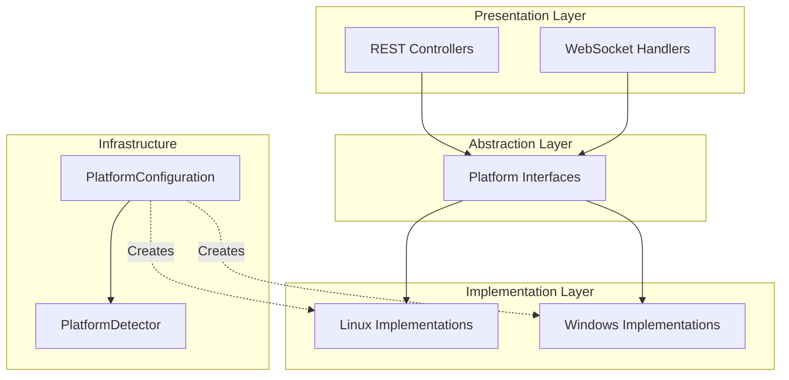
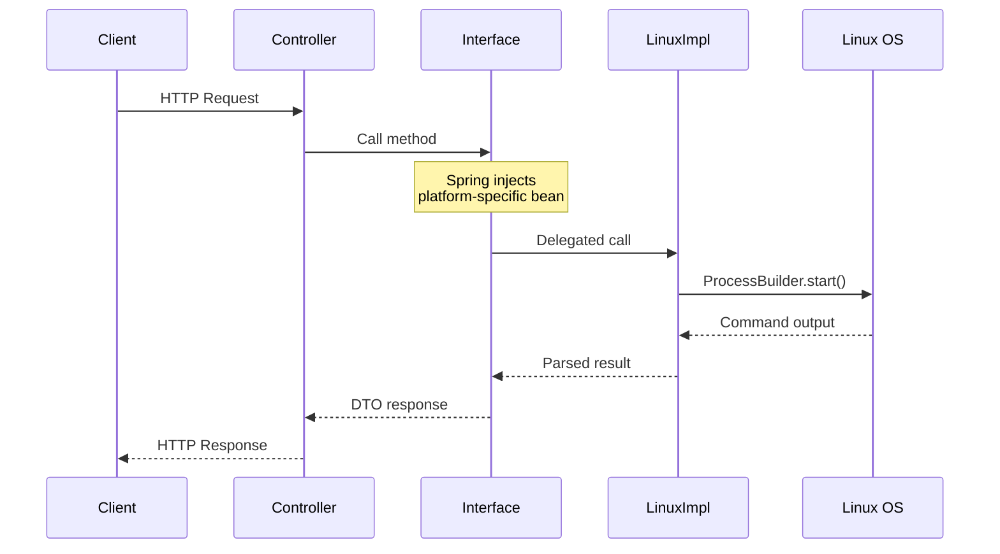
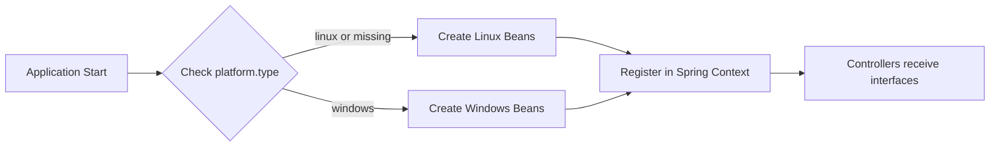

# Platform Strategy Pattern Developer Guide

## Table of Contents

1. [Introduction](#introduction)
2. [Architecture Overview](#architecture-overview)
3. [Directory Structure](#directory-structure)
4. [Core Components](#core-components)
5. [Interface Specifications](#interface-specifications)
6. [Adding Windows Support](#adding-windows-support)
7. [Configuration](#configuration)
8. [Testing Guidelines](#testing-guidelines)
9. [Best Practices](#best-practices)
10. [Troubleshooting](#troubleshooting)

---

## Introduction

### Purpose

The Hashi backend uses the **Strategy Pattern** to abstract platform-specific code, enabling the application to run on different operating systems without modifying the core business logic. This pattern separates the "what" (interface) from the "how" (implementation), allowing developers to add support for new platforms by simply providing new implementations.

### Design Goals

- **Platform Independence**: Controllers and handlers work with interfaces, not concrete implementations
- **Easy Extensibility**: Add new platform support without modifying existing code
- **Single Responsibility**: Each platform implementation handles only its own system commands
- **Testability**: Interfaces can be mocked for unit testing

### Current Status

| Platform | Status | Notes |
|----------|--------|-------|
| Linux | ✅ Fully Implemented | systemd, ufw, iptables, crontab, bash, journalctl, PAM |
| Windows | ⏳ Ready for Development | Interfaces defined, implementations needed |
| macOS | ❌ Not Planned | Could be added using similar approach |

---

## Architecture Overview

### High-Level Architecture



### Component Interaction



### Dependency Injection Flow

Spring Boot automatically selects the correct implementation based on the `platform.type` property:



---

## Directory Structure

```
src/main/java/dev/koukeneko/hashi/service/platform/
│
├── PlatformType.java              # Enum defining supported platforms
├── PlatformDetector.java          # Utility for OS detection
├── PlatformConfiguration.java     # Spring @Configuration for bean registration
│
├── service/                       # System Service Management
│   ├── ServiceManager.java        # Interface
│   ├── LinuxServiceManager.java   # Linux: systemctl
│   └── WindowsServiceManager.java # Windows: sc.exe (TODO)
│
├── firewall/                      # Firewall Management
│   ├── UfwFirewallManager.java       # Interface for UFW-style operations
│   ├── LinuxUfwFirewallManager.java  # Linux: ufw
│   ├── IptablesManager.java          # Interface for iptables operations
│   ├── LinuxIptablesManager.java     # Linux: iptables
│   └── WindowsFirewallManager.java   # Windows: netsh (TODO)
│
├── scheduler/                     # Task Scheduling
│   ├── SchedulerManager.java      # Interface
│   ├── LinuxCronManager.java      # Linux: crontab
│   └── WindowsTaskManager.java    # Windows: schtasks (TODO)
│
├── terminal/                      # Terminal/Shell Access
│   ├── TerminalManager.java         # Interface
│   ├── LinuxTerminalManager.java    # Linux: /bin/bash via PTY4J
│   └── WindowsTerminalManager.java  # Windows: powershell (TODO)
│
├── log/                           # System Log Streaming
│   ├── LogStreamProvider.java          # Interface
│   ├── LinuxJournalctlLogProvider.java # Linux: journalctl
│   └── WindowsEventLogProvider.java    # Windows: wevtutil (TODO)
│
├── auth/                          # Authentication
│   ├── LinuxPamAuthProvider.java  # Linux: PAM via su
│   └── WindowsAuthProvider.java   # Windows: SSPI (TODO)
│
└── user/                          # User/Group Management
    ├── LinuxUserManager.java      # Linux: useradd, usermod, groupadd
    └── WindowsUserManager.java    # Windows: net user (TODO)
```

---

## Core Components

### PlatformType Enum

Defines all supported platform types for type-safe platform identification.

```java
package dev.koukeneko.hashi.service.platform;

/**
 * Supported operating system platforms.
 * Used for conditional bean creation and platform-specific logic.
 */
public enum PlatformType {
    /**
     * Linux-based systems (Ubuntu, Debian, CentOS, etc.)
     * Uses: systemd, ufw, iptables, crontab, bash, journalctl, PAM
     */
    LINUX,
    
    /**
     * Microsoft Windows systems (Windows 10, Windows Server, etc.)
     * Uses: sc.exe, netsh, schtasks, powershell, Event Viewer, SSPI
     */
    WINDOWS,
    
    /**
     * Unsupported or unrecognized operating system.
     * Application may run with limited functionality.
     */
    UNSUPPORTED
}
```

### PlatformDetector Utility

Detects the current operating system at runtime using `System.getProperty("os.name")`.

```java
package dev.koukeneko.hashi.service.platform;

/**
 * Utility class for detecting the current operating system.
 * All methods are static - do not instantiate this class.
 */
public final class PlatformDetector {

    private static final String OS_NAME = System.getProperty("os.name").toLowerCase();

    private PlatformDetector() {
        // Prevent instantiation
    }

    /**
     * Detects and returns the current platform type.
     * 
     * @return PlatformType enum value
     */
    public static PlatformType detect() {
        if (isLinux()) {
            return PlatformType.LINUX;
        } else if (isWindows()) {
            return PlatformType.WINDOWS;
        }
        return PlatformType.UNSUPPORTED;
    }

    /**
     * Checks if the current OS is Linux-based.
     * Also returns true for Unix systems.
     */
    public static boolean isLinux() {
        return OS_NAME.contains("linux") || OS_NAME.contains("unix");
    }

    /**
     * Checks if the current OS is Windows.
     */
    public static boolean isWindows() {
        return OS_NAME.contains("windows");
    }

    /**
     * Checks if the current OS is macOS.
     * Note: macOS is not currently supported.
     */
    public static boolean isMac() {
        return OS_NAME.contains("mac");
    }
}
```

### PlatformConfiguration

Spring `@Configuration` class that creates platform-specific beans using conditional properties.

```java
package dev.koukeneko.hashi.service.platform;

import org.springframework.boot.autoconfigure.condition.ConditionalOnProperty;
import org.springframework.context.annotation.Bean;
import org.springframework.context.annotation.Configuration;

/**
 * Spring configuration for platform-specific service beans.
 * 
 * Uses @ConditionalOnProperty to determine which implementations to load.
 * The property "platform.type" controls which platform beans are created:
 * 
 * - "linux" (default): Creates all Linux implementations
 * - "windows": Creates all Windows implementations
 * 
 * Example application.properties:
 *   platform.type=linux    # Explicitly use Linux beans
 *   platform.type=windows  # Use Windows beans
 *   (no setting)           # Defaults to Linux beans (matchIfMissing=true)
 */
@Configuration
@Slf4j
public class PlatformConfiguration {

    @Bean
    public PlatformType platformType() {
        PlatformType type = PlatformDetector.detect();
        log.info("Detected platform: {}", type);
        return type;
    }

    // ==================== Linux Beans ====================

    @Bean
    @ConditionalOnProperty(name = "platform.type", havingValue = "linux", matchIfMissing = true)
    public ServiceManager linuxServiceManager() {
        if (!PlatformDetector.isLinux()) {
            log.warn("LinuxServiceManager loaded on non-Linux platform");
        }
        return new LinuxServiceManager();
    }

    // ... additional beans for each interface

    // ==================== Windows Beans (TODO) ====================

    // @Bean
    // @ConditionalOnProperty(name = "platform.type", havingValue = "windows")
    // public ServiceManager windowsServiceManager() {
    //     return new WindowsServiceManager();
    // }
}
```

---

## Interface Specifications

### ServiceManager

Manages system services (start, stop, restart, list).

```java
public interface ServiceManager {
    
    /**
     * Lists all system services with their current status.
     * 
     * @return List of service information DTOs
     */
    List<ServiceItemDTO> listServices();
    
    /**
     * Controls a service (start, stop, restart).
     * 
     * @param serviceName The name of the service (e.g., "nginx.service")
     * @param action One of: "start", "stop", "restart"
     * @throws IllegalArgumentException if action is not valid
     * @throws RuntimeException if the command fails or permission denied
     */
    void controlService(String serviceName, String action);
}
```

**Linux Implementation**: Uses `systemctl list-units --type=service` and `systemctl {action} {serviceName}`

**Windows Implementation (TODO)**: Should use `Get-Service` PowerShell cmdlet and `sc.exe` or `Start-Service`/`Stop-Service` cmdlets

### UfwFirewallManager

Manages UFW-style firewall rules.

```java
public interface UfwFirewallManager {
    
    /**
     * Checks if the firewall is currently enabled.
     */
    boolean isEnabled();
    
    /**
     * Enables or disables the firewall.
     */
    void setEnabled(boolean enabled);
    
    /**
     * Gets all firewall rules.
     */
    List<FirewallRuleDTO> getRules();
    
    /**
     * Adds an allow rule for a port/protocol.
     * 
     * @param port Port number or range (e.g., "80", "8000:8080")
     * @param protocol "tcp", "udp", or empty for both
     */
    void addRule(String port, String protocol);
    
    /**
     * Deletes a rule by its index.
     */
    void deleteRule(int index);
}
```

**Linux Implementation**: Uses `ufw status`, `ufw enable/disable`, `ufw allow`, `ufw delete`

**Windows Implementation (TODO)**: Should use `netsh advfirewall` commands

### IptablesManager

Manages low-level iptables rules (Linux-specific, may not have Windows equivalent).

```java
public interface IptablesManager {
    
    /**
     * Gets rules for a specific table.
     * 
     * @param table "filter", "nat", or "mangle"
     */
    List<IptablesRuleDTO> getRules(String table);
    
    /**
     * Adds a new iptables rule.
     */
    void addRule(AddIptablesRuleRequest request);
    
    /**
     * Deletes a rule by table, chain, and line number.
     */
    void deleteRule(String table, String chain, int lineNumber);
    
    /**
     * Persists rules to survive reboot.
     */
    void saveRules();
}
```

### SchedulerManager

Manages scheduled tasks.

```java
public interface SchedulerManager {
    
    /**
     * Lists all scheduled jobs.
     */
    List<CronJobDTO> listJobs();
    
    /**
     * Saves/replaces all scheduled jobs.
     * This is a full replacement - jobs not in the list will be removed.
     */
    void saveJobs(List<CronJobDTO> jobs);
}
```

**Linux Implementation**: Uses `crontab -l` and `crontab {file}`

**Windows Implementation (TODO)**: Should use `schtasks /query` and `schtasks /create`

### TerminalManager

Manages interactive terminal sessions via WebSocket.

```java
public interface TerminalManager {
    
    /**
     * Initializes a new terminal session.
     * Called when WebSocket connection is established.
     */
    void onTerminalInit(WebSocketSession session);
    
    /**
     * Handles user input (keystrokes).
     */
    void onCommand(String sessionId, String command);
    
    /**
     * Resizes the terminal window.
     */
    void resizeTerminal(String sessionId, int cols, int rows);
    
    /**
     * Closes the terminal session.
     */
    void onTerminalClose(String sessionId);
}
```

**Linux Implementation**: Uses PTY4J library with `/bin/bash`

**Windows Implementation (TODO)**: Should use PTY4J with `powershell.exe` or `cmd.exe`

### LogStreamProvider

Provides real-time system log streaming.

```java
public interface LogStreamProvider {
    
    /**
     * Starts streaming logs to a WebSocket session.
     * 
     * @return The Process object for lifecycle management
     */
    Process startLogStream(WebSocketSession session) throws Exception;
    
    /**
     * Stops the log streaming process.
     */
    void stopLogStream(Process process);
}
```

**Linux Implementation**: Uses `journalctl -f -n 100 --no-pager`

**Windows Implementation (TODO)**: Should use `wevtutil qe System /c:100 /f:text` or PowerShell `Get-EventLog`

---

## Adding Windows Support

### Step-by-Step Guide

#### Step 1: Create the Implementation Class

Create a new class in the appropriate package that implements the interface.

**Example: WindowsServiceManager.java**

```java
package dev.koukeneko.hashi.service.platform.service;

import dev.koukeneko.hashi.model.dto.ServiceItemDTO;
import lombok.extern.slf4j.Slf4j;

import java.io.BufferedReader;
import java.io.InputStreamReader;
import java.util.ArrayList;
import java.util.List;

/**
 * Windows Service Management using PowerShell.
 * 
 * Requires: PowerShell 5.0+ (Windows 10/Server 2016+)
 * Permissions: May require Administrator privileges for control operations
 */
@Slf4j
public class WindowsServiceManager implements ServiceManager {

    private static final List<String> ALLOWED_ACTIONS = List.of("start", "stop", "restart");

    @Override
    public List<ServiceItemDTO> listServices() {
        List<ServiceItemDTO> services = new ArrayList<>();
        
        try {
            // PowerShell command to get services in parseable format
            ProcessBuilder builder = new ProcessBuilder(
                "powershell", "-Command",
                "Get-Service | Select-Object Name,Status,DisplayName | " +
                "ForEach-Object { $_.Name + '|' + $_.Status + '|' + $_.DisplayName }"
            );
            
            Process process = builder.start();
            BufferedReader reader = new BufferedReader(
                new InputStreamReader(process.getInputStream())
            );
            
            String line;
            while ((line = reader.readLine()) != null) {
                String[] parts = line.split("\\|", 3);
                if (parts.length >= 3) {
                    services.add(ServiceItemDTO.builder()
                        .name(parts[0])
                        .activeState(mapWindowsStatus(parts[1]))
                        .description(parts[2])
                        .loadState("loaded")  // Windows services are always "loaded"
                        .subState(parts[1].toLowerCase())
                        .build());
                }
            }
            
            process.waitFor();
            
        } catch (Exception e) {
            log.error("Failed to list Windows services", e);
        }
        
        return services;
    }

    @Override
    public void controlService(String serviceName, String action) {
        if (!ALLOWED_ACTIONS.contains(action)) {
            throw new IllegalArgumentException("Invalid action: " + action);
        }
        
        try {
            String psCommand = switch (action) {
                case "start" -> "Start-Service -Name '" + serviceName + "'";
                case "stop" -> "Stop-Service -Name '" + serviceName + "' -Force";
                case "restart" -> "Restart-Service -Name '" + serviceName + "' -Force";
                default -> throw new IllegalArgumentException("Unknown action: " + action);
            };
            
            ProcessBuilder builder = new ProcessBuilder(
                "powershell", "-Command", psCommand
            );
            builder.redirectErrorStream(true);
            
            Process process = builder.start();
            String output = new String(process.getInputStream().readAllBytes());
            int exitCode = process.waitFor();
            
            if (exitCode != 0) {
                throw new RuntimeException("Failed to " + action + " service: " + output);
            }
            
        } catch (RuntimeException e) {
            throw e;
        } catch (Exception e) {
            throw new RuntimeException("Error controlling service: " + e.getMessage(), e);
        }
    }
    
    private String mapWindowsStatus(String windowsStatus) {
        return switch (windowsStatus.toLowerCase()) {
            case "running" -> "active";
            case "stopped" -> "inactive";
            case "paused" -> "inactive";
            default -> "unknown";
        };
    }
}
```

#### Step 2: Register the Bean in PlatformConfiguration

Add a new `@Bean` method with `@ConditionalOnProperty`:

```java
// In PlatformConfiguration.java

// ==================== Windows Beans ====================

@Bean
@ConditionalOnProperty(name = "platform.type", havingValue = "windows")
public ServiceManager windowsServiceManager() {
    return new WindowsServiceManager();
}

@Bean
@ConditionalOnProperty(name = "platform.type", havingValue = "windows")
public UfwFirewallManager windowsFirewallManager() {
    return new WindowsFirewallManager();
}

// ... add beans for all other interfaces
```

#### Step 3: Configure application.properties

```properties
# For Windows deployment
platform.type=windows

# For Linux deployment (or omit for default)
platform.type=linux
```

#### Step 4: Handle Platform-Specific Features

Some features may not have direct equivalents across platforms:

```java
// In WindowsFirewallManager (implementing UfwFirewallManager)

@Override
public List<FirewallRuleDTO> getRules() {
    // Windows Firewall uses different rule structure than UFW
    // Map Windows rules to FirewallRuleDTO as best as possible
    
    // netsh advfirewall firewall show rule name=all
    // ... parse and map to DTO
}
```

---

## Configuration

### application.properties

```properties
# Platform Selection
# Values: linux, windows
# Default: linux (if not specified)
platform.type=linux

# Optional: Override specific beans for testing
# spring.main.allow-bean-definition-overriding=true
```

### application-windows.yml (Profile-based)

```yaml
platform:
  type: windows

# Windows-specific settings
windows:
  powershell:
    execution-policy: Bypass
    encoding: UTF-8
```

### Running with Profiles

```bash
# Linux (default)
java -jar hashi-backend.jar

# Windows (explicit)
java -jar hashi-backend.jar --spring.profiles.active=windows

# Or via environment variable
set SPRING_PROFILES_ACTIVE=windows
java -jar hashi-backend.jar
```

---

## Testing Guidelines

### Unit Testing with Mocks

```java
@ExtendWith(MockitoExtension.class)
class ServiceControllerTest {

    @Mock
    private ServiceManager serviceManager;

    @InjectMocks
    private ServiceController controller;

    @Test
    void listServices_shouldReturnServices() {
        // Arrange
        List<ServiceItemDTO> mockServices = List.of(
            ServiceItemDTO.builder().name("nginx").activeState("active").build()
        );
        when(serviceManager.listServices()).thenReturn(mockServices);

        // Act
        ResponseEntity<List<ServiceItemDTO>> response = controller.listServices();

        // Assert
        assertEquals(HttpStatus.OK, response.getStatusCode());
        assertEquals(1, response.getBody().size());
        assertEquals("nginx", response.getBody().get(0).name());
    }
}
```

### Integration Testing for Specific Platforms

```java
@SpringBootTest
@EnabledOnOs(OS.LINUX)
class LinuxServiceManagerIntegrationTest {

    @Autowired
    private ServiceManager serviceManager;

    @Test
    void listServices_shouldReturnRealServices() {
        List<ServiceItemDTO> services = serviceManager.listServices();
        
        assertFalse(services.isEmpty());
        // sshd or systemd should exist on most Linux systems
        assertTrue(services.stream()
            .anyMatch(s -> s.name().contains("systemd") || s.name().contains("sshd")));
    }
}

@SpringBootTest
@EnabledOnOs(OS.WINDOWS)
class WindowsServiceManagerIntegrationTest {

    @Autowired
    private ServiceManager serviceManager;

    @Test
    void listServices_shouldReturnRealServices() {
        List<ServiceItemDTO> services = serviceManager.listServices();
        
        assertFalse(services.isEmpty());
        // Common Windows services
        assertTrue(services.stream()
            .anyMatch(s -> s.name().equalsIgnoreCase("WSearch") || 
                           s.name().equalsIgnoreCase("Spooler")));
    }
}
```

---

## Best Practices

### 1. Command Execution

Always use `ProcessBuilder` for executing system commands:

```java
// DO: Use ProcessBuilder with separate arguments
ProcessBuilder pb = new ProcessBuilder("systemctl", "status", serviceName);

// DON'T: Concatenate commands (security risk)
Runtime.getRuntime().exec("systemctl status " + serviceName);
```

### 2. Error Handling

Provide meaningful error messages and handle common failure cases:

```java
try {
    Process process = builder.start();
    int exitCode = process.waitFor();
    
    if (exitCode != 0) {
        String error = new String(process.getErrorStream().readAllBytes());
        
        // Check for common issues
        if (error.contains("Permission denied") || error.contains("Access is denied")) {
            throw new SecurityException("Insufficient permissions. Run as Administrator/root.");
        }
        if (error.contains("not found") || error.contains("does not exist")) {
            throw new IllegalArgumentException("Service not found: " + serviceName);
        }
        
        throw new RuntimeException("Command failed: " + error);
    }
} catch (IOException e) {
    throw new RuntimeException("Failed to execute command: " + e.getMessage(), e);
}
```

### 3. Resource Cleanup

Always clean up processes and streams:

```java
public void onTerminalClose(String sessionId) {
    PtyProcess process = processMap.remove(sessionId);
    if (process != null) {
        try {
            process.getOutputStream().close();
            process.getInputStream().close();
        } catch (IOException ignored) {
        } finally {
            process.destroy();
        }
    }
}
```

### 4. Logging

Use appropriate log levels:

```java
log.debug("Executing command: {}", String.join(" ", command));  // Debug details
log.info("Service {} started successfully", serviceName);        // Normal operations
log.warn("Running on non-native platform");                      // Potential issues
log.error("Failed to list services", exception);                 // Errors
```

### 5. DTO Mapping

Create helper methods for consistent DTO creation:

```java
private ServiceItemDTO mapToDto(String[] parts) {
    return ServiceItemDTO.builder()
        .name(sanitize(parts[0]))
        .loadState(parts[1])
        .activeState(parts[2])
        .subState(parts[3])
        .description(parts.length > 4 ? parts[4] : "")
        .build();
}

private String sanitize(String input) {
    return input != null ? input.trim() : "";
}
```

---

## Troubleshooting

### Common Issues

#### Issue: "Permission denied" errors

**Cause**: The backend doesn't have sufficient OS-level permissions.

**Solution (Linux)**:
```bash
# Option 1: Run as root (not recommended for production)
sudo java -jar hashi-backend.jar

# Option 2: Configure sudoers (recommended)
echo "hashi-user ALL=(ALL) NOPASSWD: /usr/bin/systemctl, /usr/sbin/ufw" | sudo tee /etc/sudoers.d/hashi
```

**Solution (Windows)**:
- Run the application as Administrator
- Or configure the service to run with a privileged account

#### Issue: "Command not found"

**Cause**: Required system utilities are not installed or not in PATH.

**Solution (Linux)**:
```bash
# Ensure required packages are installed
sudo apt install systemd ufw iptables cron  # Debian/Ubuntu
sudo yum install systemd firewalld cronie   # RHEL/CentOS
```

**Solution (Windows)**:
```powershell
# Check PowerShell version
$PSVersionTable.PSVersion

# Ensure required modules are available
Get-Module -ListAvailable
```

#### Issue: Encoding problems with command output

**Cause**: Character encoding mismatch between process output and Java.

**Solution**:
```java
// Specify encoding explicitly
BufferedReader reader = new BufferedReader(
    new InputStreamReader(process.getInputStream(), StandardCharsets.UTF_8)
);

// For Windows PowerShell, set output encoding
ProcessBuilder pb = new ProcessBuilder(
    "powershell", "-Command", 
    "[Console]::OutputEncoding = [Text.Encoding]::UTF8; Get-Service"
);
```

#### Issue: Beans not being created for the correct platform

**Cause**: `platform.type` property not set or incorrect.

**Solution**:
```properties
# Check effective configuration
logging.level.dev.koukeneko.hashi.service.platform=DEBUG
```

```java
// Add logging to verify bean creation
@Bean
public ServiceManager linuxServiceManager() {
    log.info("Creating LinuxServiceManager bean");
    return new LinuxServiceManager();
}
```

---

## References

- [Spring Conditional Bean Documentation](https://docs.spring.io/spring-boot/docs/current/reference/html/features.html#features.developing-auto-configuration.condition-annotations)
- [ProcessBuilder JavaDoc](https://docs.oracle.com/en/java/javase/17/docs/api/java.base/java/lang/ProcessBuilder.html)
- [PTY4J Library](https://github.com/JetBrains/pty4j)
- [systemd Documentation](https://www.freedesktop.org/software/systemd/man/)
- [Windows Service Control (sc.exe)](https://docs.microsoft.com/en-us/windows-server/administration/windows-commands/sc-query)
- [PowerShell Service Cmdlets](https://docs.microsoft.com/en-us/powershell/module/microsoft.powershell.management/get-service)
