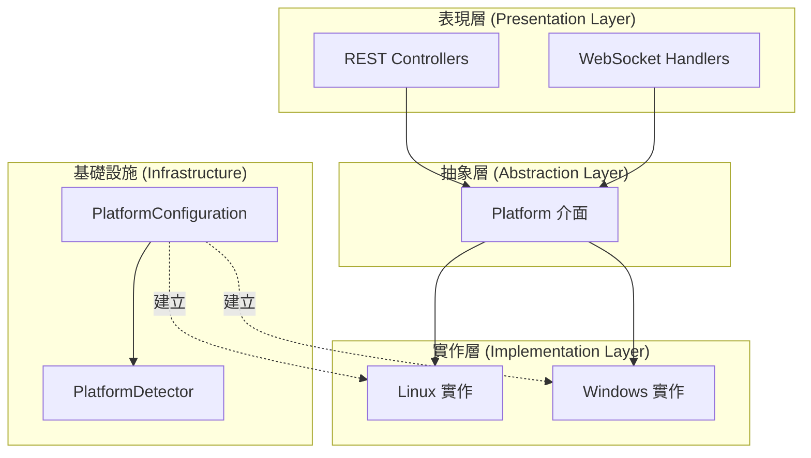
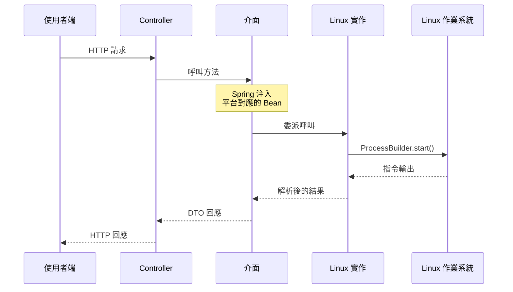
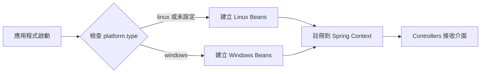

# Platform Strategy Pattern 開發指南

## 目錄

1. [簡介](#簡介)
2. [架構概覽](#架構概覽)
3. [目錄結構](#目錄結構)
4. [核心元件](#核心元件)
5. [介面規格](#介面規格)
6. [新增 Windows 支援](#新增-windows-支援)
7. [設定說明](#設定說明)
8. [測試指南](#測試指南)
9. [最佳實踐](#最佳實踐)
10. [疑難排解](#疑難排解)

---

## 簡介

### 目的

Hashi 後端使用 **Strategy Pattern（策略模式）** 將平台特定程式碼抽象化，讓應用程式可以在不同作業系統上運行，而無需修改核心業務邏輯。此模式將「做什麼」（介面）和「怎麼做」（實作）分離，開發者只需提供新的實作類別即可支援新平台。

### 設計目標

- **平台獨立性**：Controllers 和 Handlers 只依賴介面，不依賴具體實作
- **易於擴充**：新增平台支援時無需修改現有程式碼
- **單一職責**：每個平台實作只處理自己的系統指令
- **可測試性**：介面可被 Mock 進行單元測試

### 目前支援狀態

| 平台 | 狀態 | 備註 |
|------|------|------|
| Linux | ✅ 完整實作 | systemd, ufw, iptables, crontab, bash, journalctl, PAM |
| Windows | ⏳ 待開發 | 介面已定義，需要實作類別 |
| macOS | ❌ 未規劃 | 可使用類似方式新增 |

---

## 架構概覽

### 高層架構圖



### 元件互動序列圖



### 依賴注入流程

Spring Boot 根據 `platform.type` 屬性自動選擇正確的實作：



---

## 目錄結構

```
src/main/java/dev/koukeneko/hashi/service/platform/
│
├── PlatformType.java              # 定義支援的平台類型
├── PlatformDetector.java          # 作業系統偵測工具
├── PlatformConfiguration.java     # Spring @Configuration Bean 註冊
│
├── service/                       # 系統服務管理
│   ├── ServiceManager.java        # 介面
│   ├── LinuxServiceManager.java   # Linux: systemctl
│   └── WindowsServiceManager.java # Windows: sc.exe (待開發)
│
├── firewall/                      # 防火牆管理
│   ├── UfwFirewallManager.java       # UFW 風格操作介面
│   ├── LinuxUfwFirewallManager.java  # Linux: ufw
│   ├── IptablesManager.java          # iptables 操作介面
│   ├── LinuxIptablesManager.java     # Linux: iptables
│   └── WindowsFirewallManager.java   # Windows: netsh (待開發)
│
├── scheduler/                     # 排程管理
│   ├── SchedulerManager.java      # 介面
│   ├── LinuxCronManager.java      # Linux: crontab
│   └── WindowsTaskManager.java    # Windows: schtasks (待開發)
│
├── terminal/                      # 終端機/Shell 存取
│   ├── TerminalManager.java         # 介面
│   ├── LinuxTerminalManager.java    # Linux: /bin/bash (PTY4J)
│   └── WindowsTerminalManager.java  # Windows: powershell (待開發)
│
├── log/                           # 系統 Log 串流
│   ├── LogStreamProvider.java          # 介面
│   ├── LinuxJournalctlLogProvider.java # Linux: journalctl
│   └── WindowsEventLogProvider.java    # Windows: wevtutil (待開發)
│
├── auth/                          # 認證
│   ├── LinuxPamAuthProvider.java  # Linux: PAM (su 指令)
│   └── WindowsAuthProvider.java   # Windows: SSPI (待開發)
│
└── user/                          # 使用者/群組管理
    ├── LinuxUserManager.java      # Linux: useradd, usermod, groupadd
    └── WindowsUserManager.java    # Windows: net user (待開發)
```

---

## 核心元件

### PlatformType 列舉

定義所有支援的平台類型，用於類型安全的平台識別。

```java
package dev.koukeneko.hashi.service.platform;

/**
 * 支援的作業系統平台。
 * 用於條件式 Bean 建立和平台特定邏輯。
 */
public enum PlatformType {
    /**
     * Linux 系統 (Ubuntu, Debian, CentOS 等)
     * 使用：systemd, ufw, iptables, crontab, bash, journalctl, PAM
     */
    LINUX,
    
    /**
     * Microsoft Windows 系統 (Windows 10, Windows Server 等)
     * 使用：sc.exe, netsh, schtasks, powershell, Event Viewer, SSPI
     */
    WINDOWS,
    
    /**
     * 不支援或無法識別的作業系統。
     * 應用程式可能只有有限的功能。
     */
    UNSUPPORTED
}
```

### PlatformDetector 工具類別

在執行時使用 `System.getProperty("os.name")` 偵測目前的作業系統。

```java
package dev.koukeneko.hashi.service.platform;

/**
 * 偵測目前作業系統的工具類別。
 * 所有方法都是靜態的 - 不要實例化此類別。
 */
public final class PlatformDetector {

    private static final String OS_NAME = System.getProperty("os.name").toLowerCase();

    private PlatformDetector() {
        // 禁止實例化
    }

    /**
     * 偵測並回傳目前的平台類型。
     * 
     * @return PlatformType 列舉值
     */
    public static PlatformType detect() {
        if (isLinux()) {
            return PlatformType.LINUX;
        } else if (isWindows()) {
            return PlatformType.WINDOWS;
        }
        return PlatformType.UNSUPPORTED;
    }

    /**
     * 檢查目前作業系統是否為 Linux。
     * Unix 系統也會回傳 true。
     */
    public static boolean isLinux() {
        return OS_NAME.contains("linux") || OS_NAME.contains("unix");
    }

    /**
     * 檢查目前作業系統是否為 Windows。
     */
    public static boolean isWindows() {
        return OS_NAME.contains("windows");
    }

    /**
     * 檢查目前作業系統是否為 macOS。
     * 注意：macOS 目前不支援。
     */
    public static boolean isMac() {
        return OS_NAME.contains("mac");
    }
}
```

### PlatformConfiguration 設定類別

Spring `@Configuration` 類別，使用條件式屬性建立平台特定的 Beans。

```java
package dev.koukeneko.hashi.service.platform;

import org.springframework.boot.autoconfigure.condition.ConditionalOnProperty;
import org.springframework.context.annotation.Bean;
import org.springframework.context.annotation.Configuration;

/**
 * 平台特定服務 Beans 的 Spring 設定。
 * 
 * 使用 @ConditionalOnProperty 決定要載入哪些實作。
 * 屬性 "platform.type" 控制要建立哪些 Beans：
 * 
 * - "linux" (預設)：建立所有 Linux 實作
 * - "windows"：建立所有 Windows 實作
 * 
 * 範例 application.properties：
 *   platform.type=linux    # 明確使用 Linux beans
 *   platform.type=windows  # 使用 Windows beans
 *   (未設定)               # 預設使用 Linux beans (matchIfMissing=true)
 */
@Configuration
@Slf4j
public class PlatformConfiguration {

    @Bean
    public PlatformType platformType() {
        PlatformType type = PlatformDetector.detect();
        log.info("偵測到平台：{}", type);
        return type;
    }

    // ==================== Linux Beans ====================

    @Bean
    @ConditionalOnProperty(name = "platform.type", havingValue = "linux", matchIfMissing = true)
    public ServiceManager linuxServiceManager() {
        if (!PlatformDetector.isLinux()) {
            log.warn("LinuxServiceManager 在非 Linux 平台上載入");
        }
        return new LinuxServiceManager();
    }

    // ... 每個介面的額外 beans

    // ==================== Windows Beans (待開發) ====================

    // @Bean
    // @ConditionalOnProperty(name = "platform.type", havingValue = "windows")
    // public ServiceManager windowsServiceManager() {
    //     return new WindowsServiceManager();
    // }
}
```

---

## 介面規格

### ServiceManager

管理系統服務（啟動、停止、重啟、列出）。

```java
public interface ServiceManager {
    
    /**
     * 列出所有系統服務及其目前狀態。
     * 
     * @return 服務資訊 DTO 列表
     */
    List<ServiceItemDTO> listServices();
    
    /**
     * 控制服務（啟動、停止、重啟）。
     * 
     * @param serviceName 服務名稱（例如 "nginx.service"）
     * @param action 操作類型："start"、"stop"、"restart"
     * @throws IllegalArgumentException 如果 action 無效
     * @throws RuntimeException 如果指令失敗或權限不足
     */
    void controlService(String serviceName, String action);
}
```

**Linux 實作**：使用 `systemctl list-units --type=service` 和 `systemctl {action} {serviceName}`

**Windows 實作（待開發）**：應使用 `Get-Service` PowerShell cmdlet 和 `sc.exe` 或 `Start-Service`/`Stop-Service` cmdlets

### UfwFirewallManager

管理 UFW 風格的防火牆規則。

```java
public interface UfwFirewallManager {
    
    /**
     * 檢查防火牆是否目前啟用。
     */
    boolean isEnabled();
    
    /**
     * 啟用或停用防火牆。
     */
    void setEnabled(boolean enabled);
    
    /**
     * 取得所有防火牆規則。
     */
    List<FirewallRuleDTO> getRules();
    
    /**
     * 為 port/protocol 新增允許規則。
     * 
     * @param port 埠號或範圍（例如 "80"、"8000:8080"）
     * @param protocol "tcp"、"udp" 或空字串（兩者皆可）
     */
    void addRule(String port, String protocol);
    
    /**
     * 依索引刪除規則。
     */
    void deleteRule(int index);
}
```

**Linux 實作**：使用 `ufw status`、`ufw enable/disable`、`ufw allow`、`ufw delete`

**Windows 實作（待開發）**：應使用 `netsh advfirewall` 指令

### IptablesManager

管理低層 iptables 規則（Linux 專用，可能沒有 Windows 對應）。

```java
public interface IptablesManager {
    
    /**
     * 取得特定 table 的規則。
     * 
     * @param table "filter"、"nat" 或 "mangle"
     */
    List<IptablesRuleDTO> getRules(String table);
    
    /**
     * 新增 iptables 規則。
     */
    void addRule(AddIptablesRuleRequest request);
    
    /**
     * 依 table、chain 和行號刪除規則。
     */
    void deleteRule(String table, String chain, int lineNumber);
    
    /**
     * 持久化規則以在重開機後保留。
     */
    void saveRules();
}
```

### SchedulerManager

管理排程任務。

```java
public interface SchedulerManager {
    
    /**
     * 列出所有排程任務。
     */
    List<CronJobDTO> listJobs();
    
    /**
     * 儲存/取代所有排程任務。
     * 這是完整取代 - 不在列表中的任務會被移除。
     */
    void saveJobs(List<CronJobDTO> jobs);
}
```

**Linux 實作**：使用 `crontab -l` 和 `crontab {file}`

**Windows 實作（待開發）**：應使用 `schtasks /query` 和 `schtasks /create`

### TerminalManager

透過 WebSocket 管理互動式終端機工作階段。

```java
public interface TerminalManager {
    
    /**
     * 初始化新的終端機工作階段。
     * 當 WebSocket 連線建立時呼叫。
     */
    void onTerminalInit(WebSocketSession session);
    
    /**
     * 處理使用者輸入（按鍵）。
     */
    void onCommand(String sessionId, String command);
    
    /**
     * 調整終端機視窗大小。
     */
    void resizeTerminal(String sessionId, int cols, int rows);
    
    /**
     * 關閉終端機工作階段。
     */
    void onTerminalClose(String sessionId);
}
```

**Linux 實作**：使用 PTY4J 函式庫搭配 `/bin/bash`

**Windows 實作（待開發）**：應使用 PTY4J 搭配 `powershell.exe` 或 `cmd.exe`

### LogStreamProvider

提供即時系統 Log 串流。

```java
public interface LogStreamProvider {
    
    /**
     * 開始串流 log 到 WebSocket 工作階段。
     * 
     * @return Process 物件用於生命週期管理
     */
    Process startLogStream(WebSocketSession session) throws Exception;
    
    /**
     * 停止 log 串流程序。
     */
    void stopLogStream(Process process);
}
```

**Linux 實作**：使用 `journalctl -f -n 100 --no-pager`

**Windows 實作（待開發）**：應使用 `wevtutil qe System /c:100 /f:text` 或 PowerShell `Get-EventLog`

---

## 新增 Windows 支援

### 步驟指南

#### 步驟 1：建立實作類別

在適當的 package 中建立實作介面的新類別。

**範例：WindowsServiceManager.java**

```java
package dev.koukeneko.hashi.service.platform.service;

import dev.koukeneko.hashi.model.dto.ServiceItemDTO;
import lombok.extern.slf4j.Slf4j;

import java.io.BufferedReader;
import java.io.InputStreamReader;
import java.util.ArrayList;
import java.util.List;

/**
 * 使用 PowerShell 的 Windows 服務管理。
 * 
 * 需求：PowerShell 5.0+ (Windows 10/Server 2016+)
 * 權限：控制操作可能需要系統管理員權限
 */
@Slf4j
public class WindowsServiceManager implements ServiceManager {

    private static final List<String> ALLOWED_ACTIONS = List.of("start", "stop", "restart");

    @Override
    public List<ServiceItemDTO> listServices() {
        List<ServiceItemDTO> services = new ArrayList<>();
        
        try {
            // PowerShell 指令以可解析格式取得服務
            ProcessBuilder builder = new ProcessBuilder(
                "powershell", "-Command",
                "Get-Service | Select-Object Name,Status,DisplayName | " +
                "ForEach-Object { $_.Name + '|' + $_.Status + '|' + $_.DisplayName }"
            );
            
            Process process = builder.start();
            BufferedReader reader = new BufferedReader(
                new InputStreamReader(process.getInputStream())
            );
            
            String line;
            while ((line = reader.readLine()) != null) {
                String[] parts = line.split("\\|", 3);
                if (parts.length >= 3) {
                    services.add(ServiceItemDTO.builder()
                        .name(parts[0])
                        .activeState(mapWindowsStatus(parts[1]))
                        .description(parts[2])
                        .loadState("loaded")  // Windows 服務總是 "loaded"
                        .subState(parts[1].toLowerCase())
                        .build());
                }
            }
            
            process.waitFor();
            
        } catch (Exception e) {
            log.error("無法列出 Windows 服務", e);
        }
        
        return services;
    }

    @Override
    public void controlService(String serviceName, String action) {
        if (!ALLOWED_ACTIONS.contains(action)) {
            throw new IllegalArgumentException("無效的操作：" + action);
        }
        
        try {
            String psCommand = switch (action) {
                case "start" -> "Start-Service -Name '" + serviceName + "'";
                case "stop" -> "Stop-Service -Name '" + serviceName + "' -Force";
                case "restart" -> "Restart-Service -Name '" + serviceName + "' -Force";
                default -> throw new IllegalArgumentException("未知操作：" + action);
            };
            
            ProcessBuilder builder = new ProcessBuilder(
                "powershell", "-Command", psCommand
            );
            builder.redirectErrorStream(true);
            
            Process process = builder.start();
            String output = new String(process.getInputStream().readAllBytes());
            int exitCode = process.waitFor();
            
            if (exitCode != 0) {
                throw new RuntimeException("無法 " + action + " 服務：" + output);
            }
            
        } catch (RuntimeException e) {
            throw e;
        } catch (Exception e) {
            throw new RuntimeException("控制服務時發生錯誤：" + e.getMessage(), e);
        }
    }
    
    private String mapWindowsStatus(String windowsStatus) {
        return switch (windowsStatus.toLowerCase()) {
            case "running" -> "active";
            case "stopped" -> "inactive";
            case "paused" -> "inactive";
            default -> "unknown";
        };
    }
}
```

#### 步驟 2：在 PlatformConfiguration 註冊 Bean

新增帶有 `@ConditionalOnProperty` 的 `@Bean` 方法：

```java
// 在 PlatformConfiguration.java

// ==================== Windows Beans ====================

@Bean
@ConditionalOnProperty(name = "platform.type", havingValue = "windows")
public ServiceManager windowsServiceManager() {
    return new WindowsServiceManager();
}

@Bean
@ConditionalOnProperty(name = "platform.type", havingValue = "windows")
public UfwFirewallManager windowsFirewallManager() {
    return new WindowsFirewallManager();
}

// ... 為所有其他介面新增 beans
```

#### 步驟 3：設定 application.properties

```properties
# Windows 部署
platform.type=windows

# Linux 部署（或省略使用預設值）
platform.type=linux
```

#### 步驟 4：處理平台特定功能

某些功能可能沒有跨平台的直接對應：

```java
// 在 WindowsFirewallManager（實作 UfwFirewallManager）

@Override
public List<FirewallRuleDTO> getRules() {
    // Windows 防火牆使用與 UFW 不同的規則結構
    // 盡可能將 Windows 規則對應到 FirewallRuleDTO
    
    // netsh advfirewall firewall show rule name=all
    // ... 解析並對應到 DTO
}
```

---

## 設定說明

### application.properties

```properties
# 平台選擇
# 值：linux, windows
# 預設：linux（如果未指定）
platform.type=linux

# 選用：覆蓋特定 beans 用於測試
# spring.main.allow-bean-definition-overriding=true
```

### application-windows.yml（基於 Profile）

```yaml
platform:
  type: windows

# Windows 特定設定
windows:
  powershell:
    execution-policy: Bypass
    encoding: UTF-8
```

### 使用 Profiles 執行

```bash
# Linux（預設）
java -jar hashi-backend.jar

# Windows（明確指定）
java -jar hashi-backend.jar --spring.profiles.active=windows

# 或透過環境變數
set SPRING_PROFILES_ACTIVE=windows
java -jar hashi-backend.jar
```

---

## 測試指南

### 使用 Mock 進行單元測試

```java
@ExtendWith(MockitoExtension.class)
class ServiceControllerTest {

    @Mock
    private ServiceManager serviceManager;

    @InjectMocks
    private ServiceController controller;

    @Test
    void listServices_應該回傳服務列表() {
        // 準備
        List<ServiceItemDTO> mockServices = List.of(
            ServiceItemDTO.builder().name("nginx").activeState("active").build()
        );
        when(serviceManager.listServices()).thenReturn(mockServices);

        // 執行
        ResponseEntity<List<ServiceItemDTO>> response = controller.listServices();

        // 驗證
        assertEquals(HttpStatus.OK, response.getStatusCode());
        assertEquals(1, response.getBody().size());
        assertEquals("nginx", response.getBody().get(0).name());
    }
}
```

### 特定平台的整合測試

```java
@SpringBootTest
@EnabledOnOs(OS.LINUX)
class LinuxServiceManagerIntegrationTest {

    @Autowired
    private ServiceManager serviceManager;

    @Test
    void listServices_應該回傳真實服務() {
        List<ServiceItemDTO> services = serviceManager.listServices();
        
        assertFalse(services.isEmpty());
        // 大多數 Linux 系統應該有 sshd 或 systemd
        assertTrue(services.stream()
            .anyMatch(s -> s.name().contains("systemd") || s.name().contains("sshd")));
    }
}

@SpringBootTest
@EnabledOnOs(OS.WINDOWS)
class WindowsServiceManagerIntegrationTest {

    @Autowired
    private ServiceManager serviceManager;

    @Test
    void listServices_應該回傳真實服務() {
        List<ServiceItemDTO> services = serviceManager.listServices();
        
        assertFalse(services.isEmpty());
        // 常見的 Windows 服務
        assertTrue(services.stream()
            .anyMatch(s -> s.name().equalsIgnoreCase("WSearch") || 
                           s.name().equalsIgnoreCase("Spooler")));
    }
}
```

---

## 最佳實踐

### 1. 指令執行

始終使用 `ProcessBuilder` 執行系統指令：

```java
// 正確：使用 ProcessBuilder 分開參數
ProcessBuilder pb = new ProcessBuilder("systemctl", "status", serviceName);

// 錯誤：串接指令（有安全風險）
Runtime.getRuntime().exec("systemctl status " + serviceName);
```

### 2. 錯誤處理

提供有意義的錯誤訊息並處理常見失敗情況：

```java
try {
    Process process = builder.start();
    int exitCode = process.waitFor();
    
    if (exitCode != 0) {
        String error = new String(process.getErrorStream().readAllBytes());
        
        // 檢查常見問題
        if (error.contains("Permission denied") || error.contains("Access is denied")) {
            throw new SecurityException("權限不足。請以系統管理員/root 身分執行。");
        }
        if (error.contains("not found") || error.contains("does not exist")) {
            throw new IllegalArgumentException("找不到服務：" + serviceName);
        }
        
        throw new RuntimeException("指令失敗：" + error);
    }
} catch (IOException e) {
    throw new RuntimeException("執行指令失敗：" + e.getMessage(), e);
}
```

### 3. 資源清理

始終清理 processes 和 streams：

```java
public void onTerminalClose(String sessionId) {
    PtyProcess process = processMap.remove(sessionId);
    if (process != null) {
        try {
            process.getOutputStream().close();
            process.getInputStream().close();
        } catch (IOException ignored) {
        } finally {
            process.destroy();
        }
    }
}
```

### 4. 日誌記錄

使用適當的日誌等級：

```java
log.debug("執行指令：{}", String.join(" ", command));  // 除錯細節
log.info("服務 {} 啟動成功", serviceName);             // 正常操作
log.warn("在非原生平台上執行");                        // 潛在問題
log.error("無法列出服務", exception);                  // 錯誤
```

### 5. DTO 對應

建立輔助方法以一致地建立 DTO：

```java
private ServiceItemDTO mapToDto(String[] parts) {
    return ServiceItemDTO.builder()
        .name(sanitize(parts[0]))
        .loadState(parts[1])
        .activeState(parts[2])
        .subState(parts[3])
        .description(parts.length > 4 ? parts[4] : "")
        .build();
}

private String sanitize(String input) {
    return input != null ? input.trim() : "";
}
```

---

## 疑難排解

### 常見問題

#### 問題：「Permission denied」錯誤

**原因**：後端沒有足夠的作業系統層級權限。

**解決方案（Linux）**：
```bash
# 選項 1：以 root 執行（不建議用於正式環境）
sudo java -jar hashi-backend.jar

# 選項 2：設定 sudoers（建議）
echo "hashi-user ALL=(ALL) NOPASSWD: /usr/bin/systemctl, /usr/sbin/ufw" | sudo tee /etc/sudoers.d/hashi
```

**解決方案（Windows）**：
- 以系統管理員身分執行應用程式
- 或設定服務以特權帳戶執行

#### 問題：「Command not found」

**原因**：必要的系統工具未安裝或不在 PATH 中。

**解決方案（Linux）**：
```bash
# 確保安裝必要的套件
sudo apt install systemd ufw iptables cron  # Debian/Ubuntu
sudo yum install systemd firewalld cronie   # RHEL/CentOS
```

**解決方案（Windows）**：
```powershell
# 檢查 PowerShell 版本
$PSVersionTable.PSVersion

# 確保必要的模組可用
Get-Module -ListAvailable
```

#### 問題：指令輸出編碼問題

**原因**：process 輸出和 Java 之間的字元編碼不符。

**解決方案**：
```java
// 明確指定編碼
BufferedReader reader = new BufferedReader(
    new InputStreamReader(process.getInputStream(), StandardCharsets.UTF_8)
);

// 對於 Windows PowerShell，設定輸出編碼
ProcessBuilder pb = new ProcessBuilder(
    "powershell", "-Command", 
    "[Console]::OutputEncoding = [Text.Encoding]::UTF8; Get-Service"
);
```

#### 問題：Beans 未為正確的平台建立

**原因**：`platform.type` 屬性未設定或不正確。

**解決方案**：
```properties
# 檢查有效設定
logging.level.dev.koukeneko.hashi.service.platform=DEBUG
```

```java
// 新增日誌以驗證 bean 建立
@Bean
public ServiceManager linuxServiceManager() {
    log.info("正在建立 LinuxServiceManager bean");
    return new LinuxServiceManager();
}
```

---

## API 端點

### 平台資訊 API

提供前端查詢後端運行平台和支援功能的能力。

#### GET /api/v1/platform

取得目前平台資訊。

**回應範例：**
```json
{
  "platform": "LINUX",
  "osName": "Linux",
  "osVersion": "6.17.0-7-generic",
  "osArch": "amd64"
}
```

| 欄位 | 說明 |
|------|------|
| `platform` | 平台類型（`LINUX`、`WINDOWS`、`UNSUPPORTED`） |
| `osName` | 作業系統名稱 |
| `osVersion` | 作業系統版本 |
| `osArch` | 系統架構（`amd64`、`aarch64` 等） |

#### GET /api/v1/platform/features

取得支援的功能清單，前端可根據此資訊顯示/隱藏特定功能。

**回應範例（Linux）：**
```json
{
  "serviceManager": true,
  "ufwFirewall": true,
  "iptables": true,
  "windowsFirewall": false,
  "scheduler": true,
  "terminal": true,
  "logStream": true,
  "userManagement": true
}
```

**回應範例（Windows）：**
```json
{
  "serviceManager": true,
  "ufwFirewall": false,
  "iptables": false,
  "windowsFirewall": true,
  "scheduler": true,
  "terminal": true,
  "logStream": true,
  "userManagement": true
}
```

### 前端使用範例

```typescript
import { useEffect, useState } from 'react';
import api from '@/lib/api';

interface PlatformInfo {
  platform: 'LINUX' | 'WINDOWS' | 'UNSUPPORTED';
  osName: string;
  osVersion: string;
  osArch: string;
}

interface PlatformFeatures {
  serviceManager: boolean;
  ufwFirewall: boolean;
  iptables: boolean;
  windowsFirewall: boolean;
  scheduler: boolean;
  terminal: boolean;
  logStream: boolean;
  userManagement: boolean;
}

export function usePlatform() {
  const [platform, setPlatform] = useState<PlatformInfo | null>(null);
  const [features, setFeatures] = useState<PlatformFeatures | null>(null);

  useEffect(() => {
    // 取得平台資訊
    api.get('/api/v1/platform').then(res => setPlatform(res.data));
    // 取得支援功能
    api.get('/api/v1/platform/features').then(res => setFeatures(res.data));
  }, []);

  return { platform, features };
}

// 在元件中使用
function FirewallPage() {
  const { features } = usePlatform();

  if (!features) return <Loading />;

  return (
    <div>
      {features.ufwFirewall && <UfwManager />}
      {features.iptables && <IptablesManager />}
      {features.windowsFirewall && <WindowsFirewallManager />}
    </div>
  );
}
```

### 與 Dashboard API 的差異

| API | 用途 | 內容 |
|-----|------|------|
| `/api/v1/dashboard/status` | 系統狀態監控 | CPU、記憶體、磁碟、網路等 |
| `/api/v1/platform` | 平台識別 | 作業系統類型、版本、架構 |
| `/api/u1/platform/features` | 功能控制 | 各功能模組的支援狀態 |

> **說明：** Dashboard 的 `osName` 是用於顯示，Platform API 的 `platform` 是用於邏輯判斷。

---

## 參考資料

- [Spring 條件式 Bean 文件](https://docs.spring.io/spring-boot/docs/current/reference/html/features.html#features.developing-auto-configuration.condition-annotations)
- [ProcessBuilder JavaDoc](https://docs.oracle.com/en/java/javase/17/docs/api/java.base/java/lang/ProcessBuilder.html)
- [PTY4J 函式庫](https://github.com/JetBrains/pty4j)
- [systemd 文件](https://www.freedesktop.org/software/systemd/man/)
- [Windows 服務控制 (sc.exe)](https://docs.microsoft.com/en-us/windows-server/administration/windows-commands/sc-query)
- [PowerShell 服務 Cmdlets](https://docs.microsoft.com/en-us/powershell/module/microsoft.powershell.management/get-service)
